# PC电脑 - Windows

## [注意事项](https://bmxcloud.fun/)

[**已经好评的记得加售后QQ群979461290**](https://bmxcloud.fun/)

[**有任何问题联系群管理员QQ** ](https://bmxcloud.fun/)

[ **淘宝不做任何回复**](https://bmxcloud.fun/)\*\*\*\*

## 下载及安装

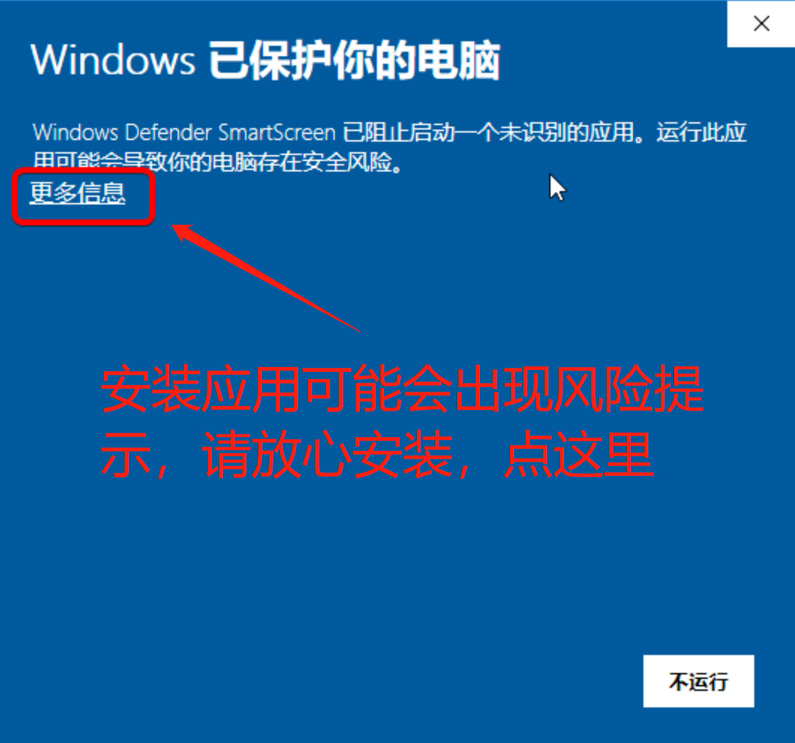

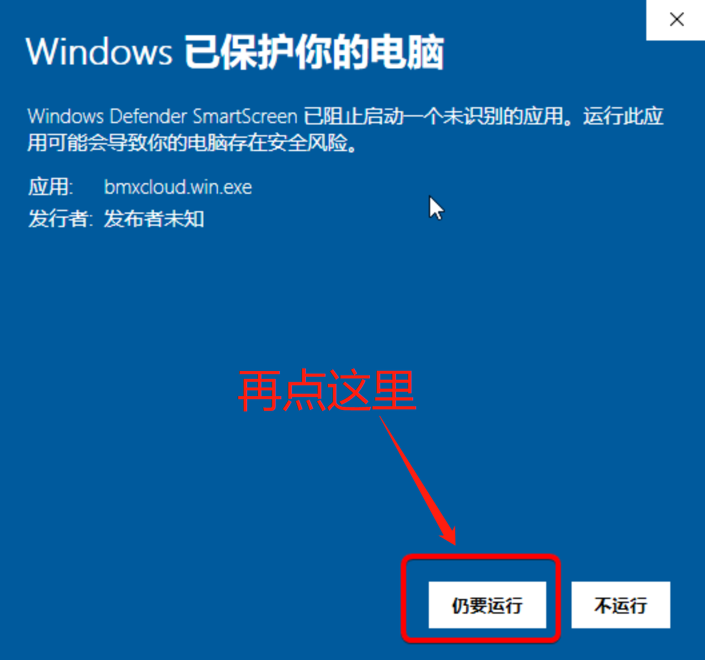

## 注册及登陆

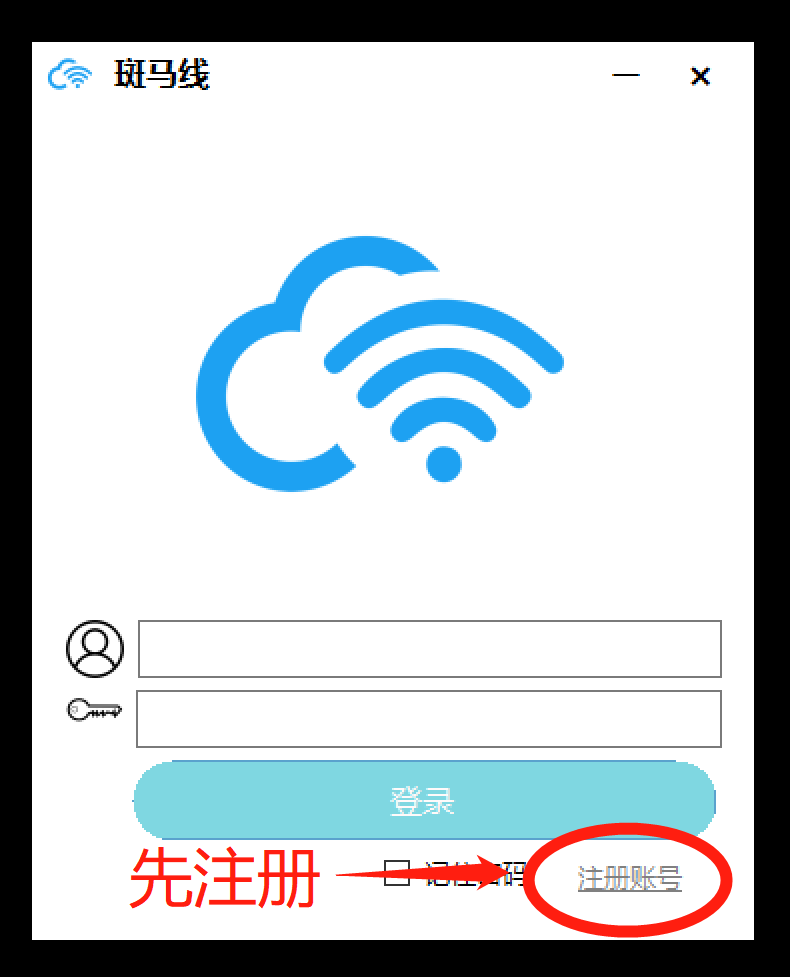

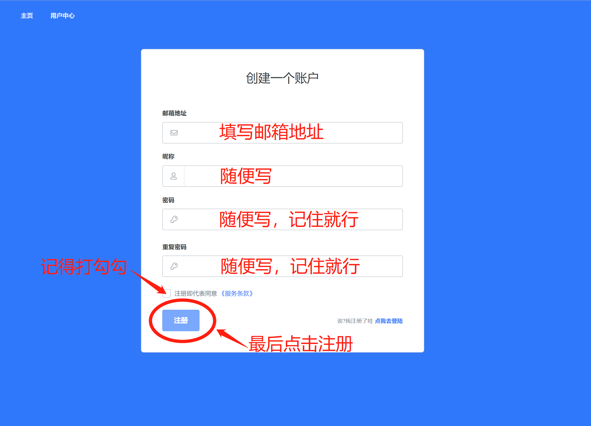

## 充值及购买

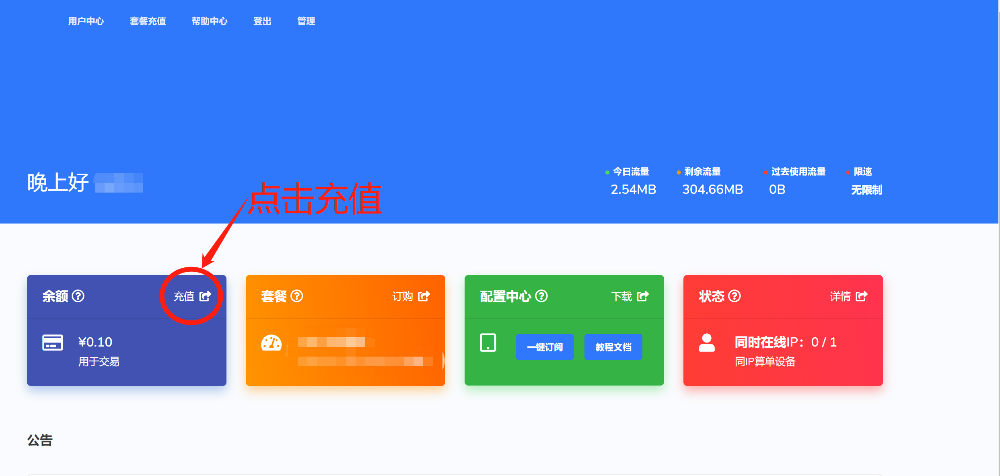

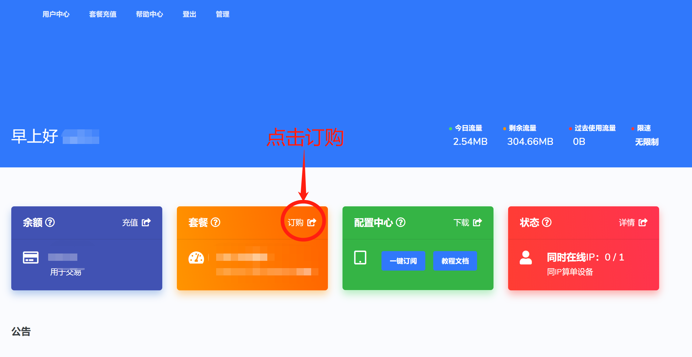

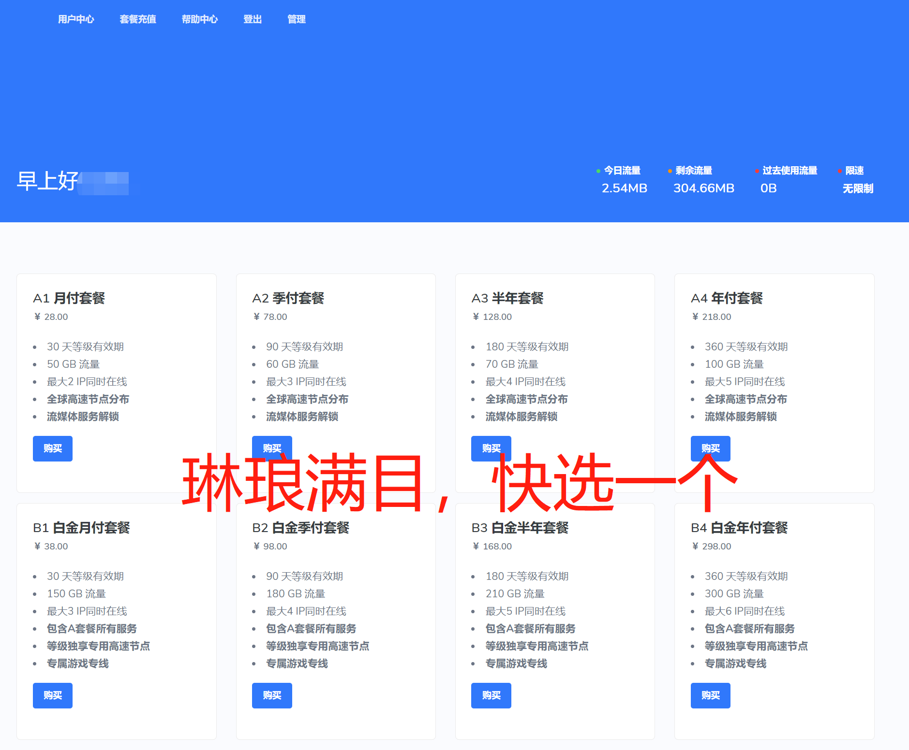

## 开启应用

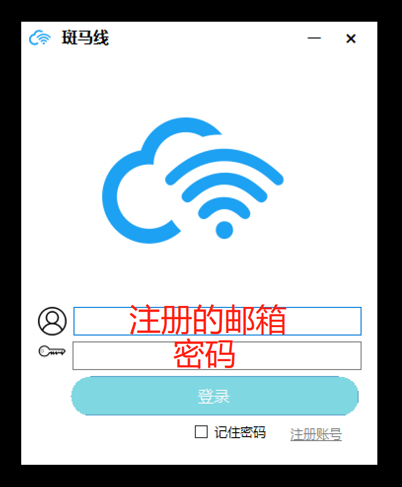

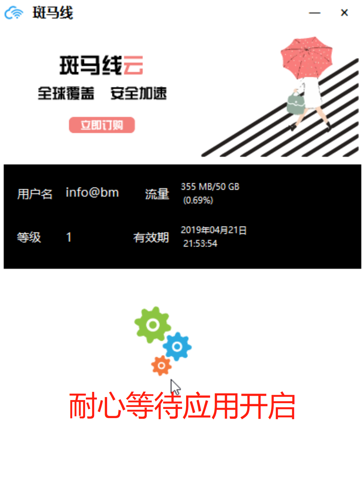

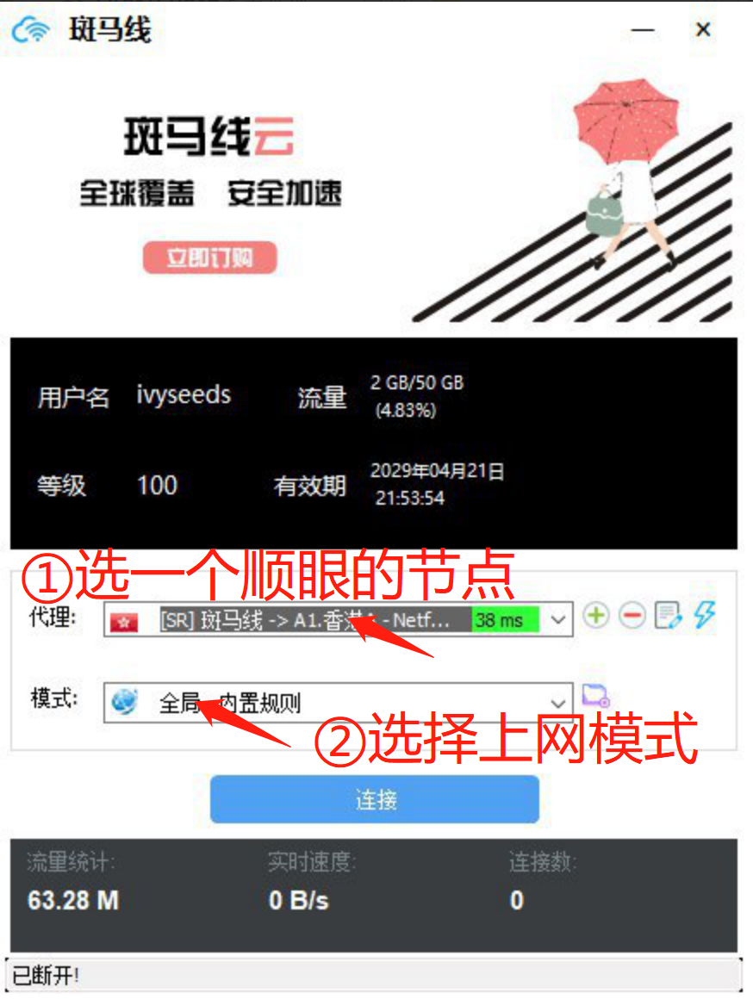

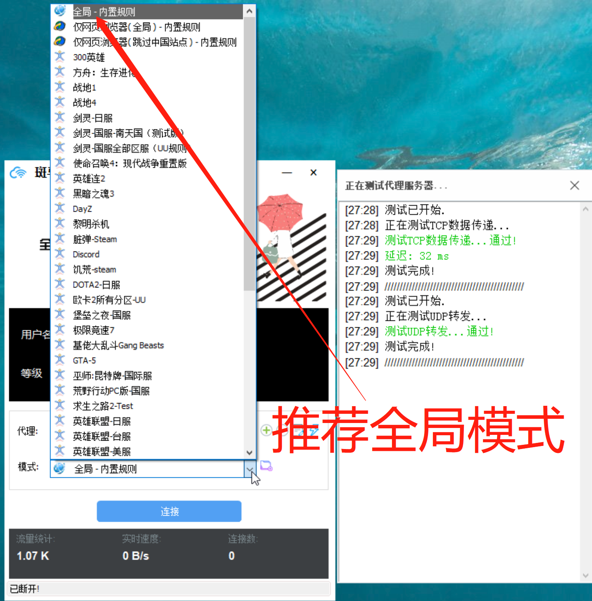

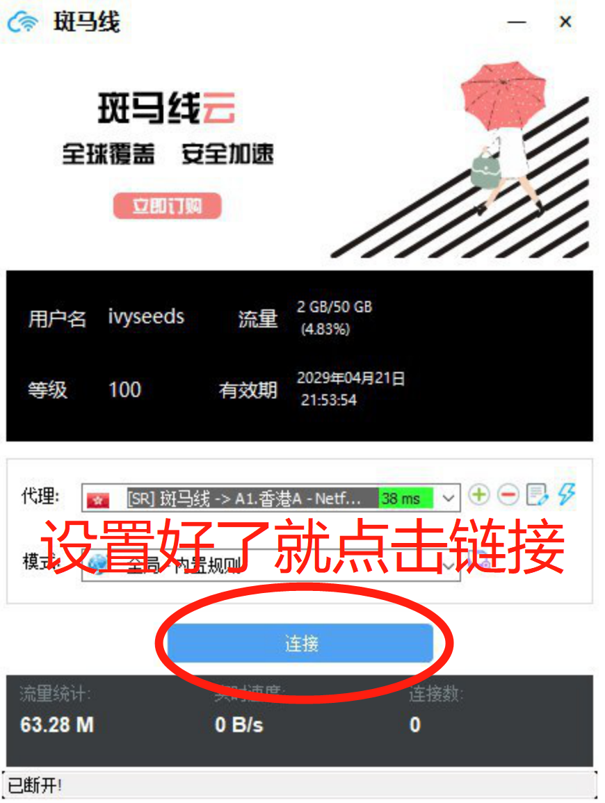

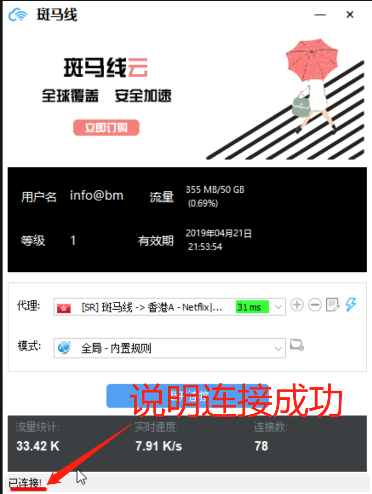

